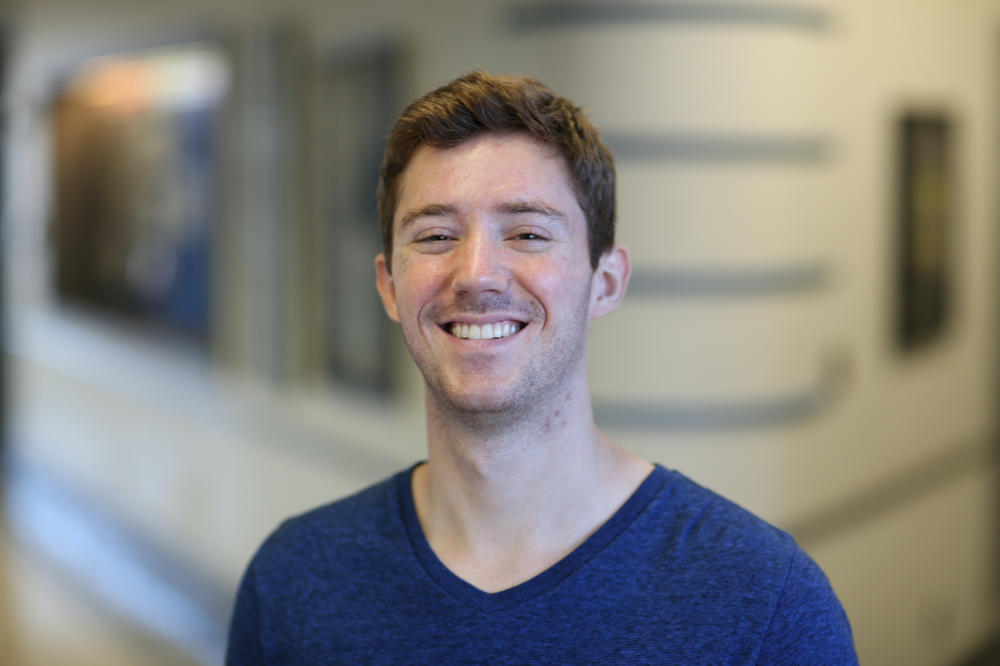

#### CURRENTLY
I am a PhD Candidate in [Dr. Yasmin Hurd’s lab](http://labs.neuroscience.mssm.edu/project/hurd-lab/) at the Icahn School of Medicine at Mount Sinai, supported by [F31](https://researchtraining.nih.gov/programs/fellowships/f31) (NIDA) and [T32](https://researchtraining.nih.gov/programs/training-grants/t32) (NIGMS) National Research Service Awards. I work at the interface of genomics, machine learning, and behavioral neuroscience to understand the molecular underpinnings of substance use disorders. 

#### PREVIOUSLY 
From 2017-2018, I was a rotation student in [Dr. Avi Ma’ayan’s lab](https://labs.icahn.mssm.edu/maayanlab/) working on applications of machine learning to [substance use disorder prediction](https://biodatamining.biomedcentral.com/articles/10.1186/s13040-019-0193-0) using electronic health records. From 2015-2017, I was a postbac in [Dr. Michael Michaelides’ lab](http://www.michaelideslab.org/) at the National Institute on Drug Abuse. 
